  

  

  

 

<strong>AMIR</strong> · AI &amp; Software Developer · building Jarvis and intelligent software systems

---

### About

I build AI-powered software, automation systems, and intelligent tools.

Current focus: **Jarvis** and the engineering of practical intelligent software systems.

### Stack

Python · Artificial Intelligence · Automation · Software Architecture · GitHub

### Profile system

This profile uses the Aqua Launch animated GitHub profile system. The generated assets are updated from the repository configuration and public GitHub data.

[Setup guide](./SETUP.md)